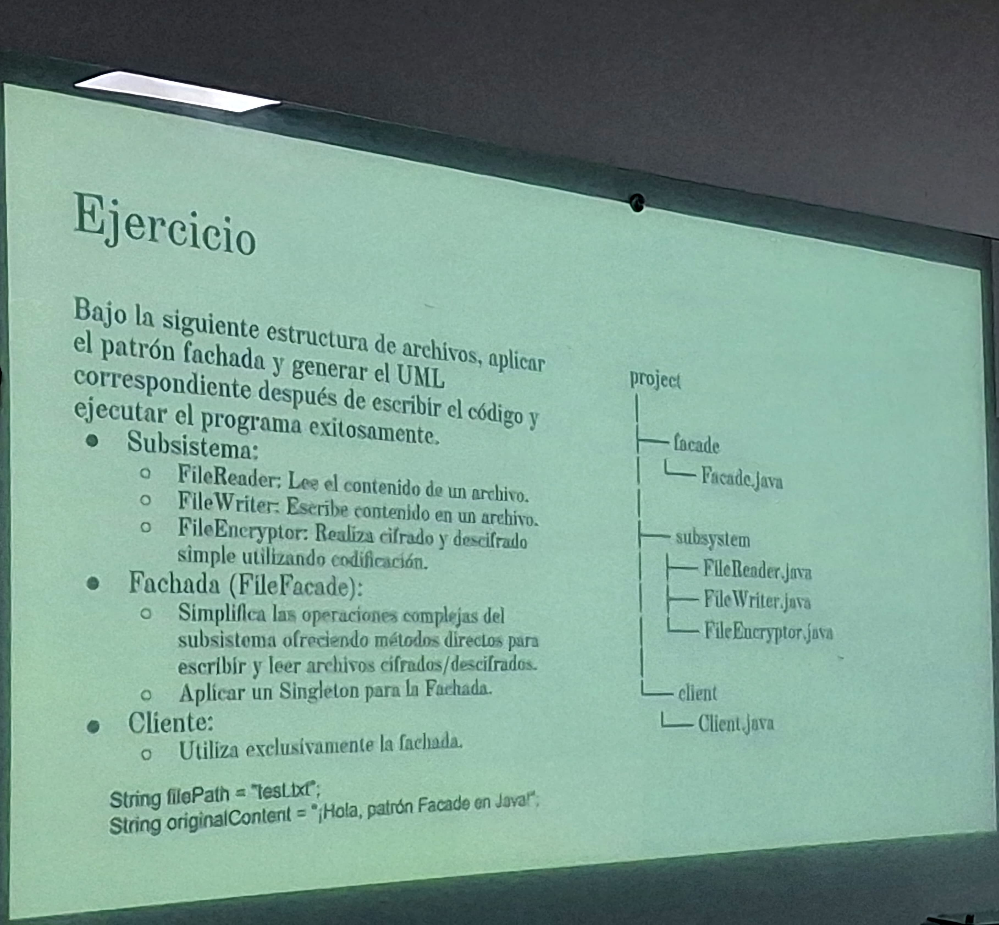
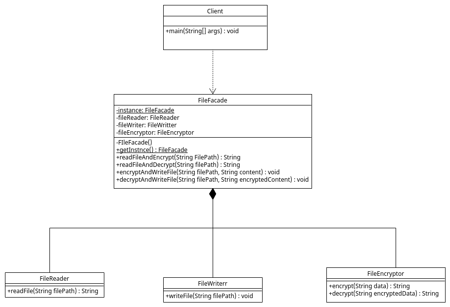

# FacadePattern

---

## 🔧 Notas Técnicas

> El archivo `FileWriterr.java` tiene una doble **'r'** intencionalmente, para evitar conflictos con el método `FileWriter` importado.
> Escribí mal el nombre en el nombre del repositorio, pero no lo voy a cambiar para no alterar la ruta.
---

## 📌 Ejercicio a Realizar

---

## 📐 Diagrama UML

